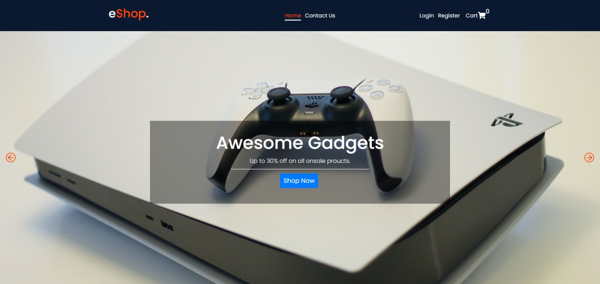
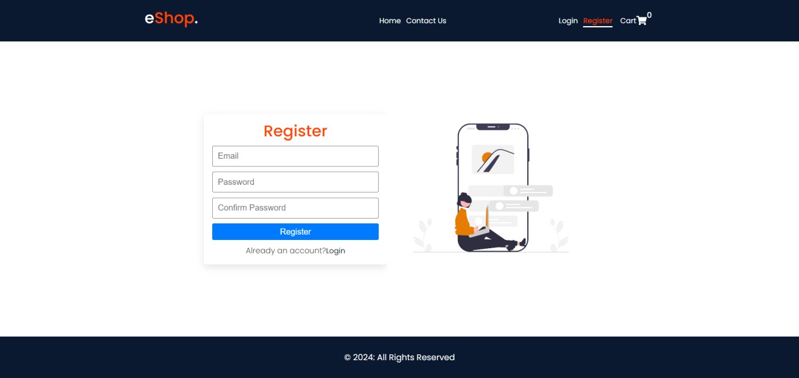
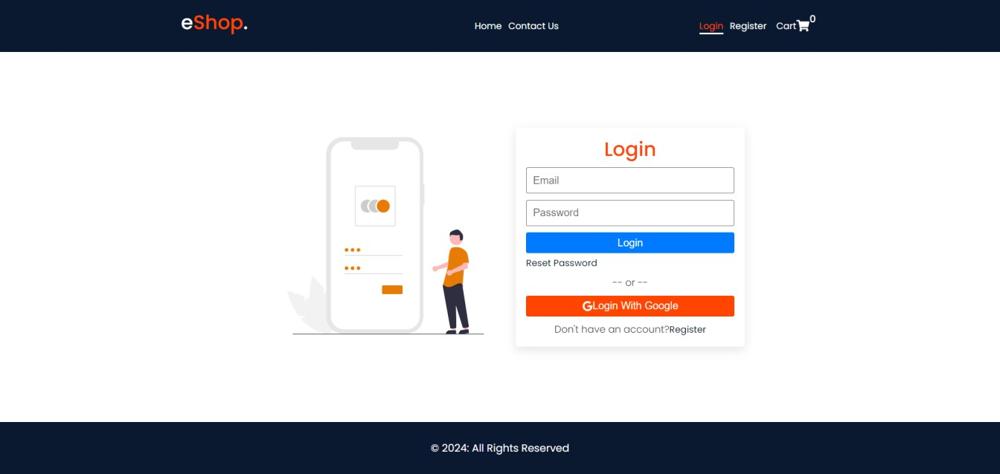
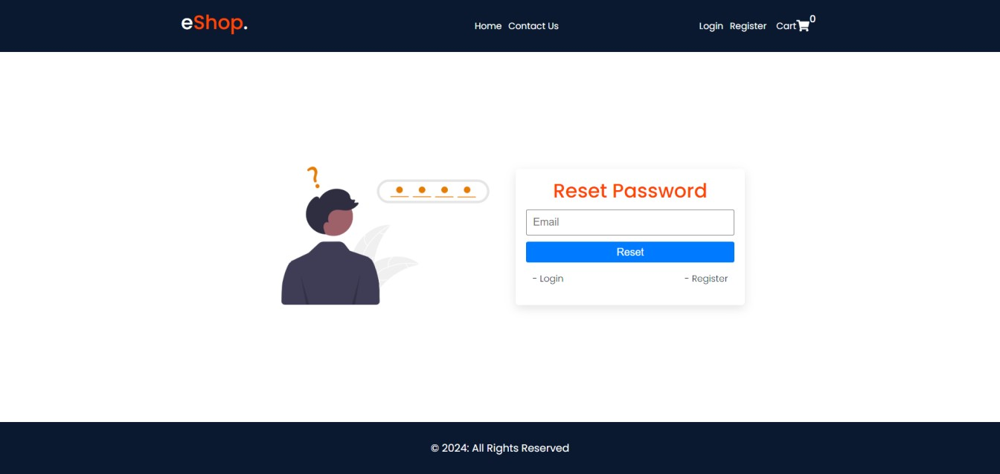

# :closed_book: eShop

### _eShop App React Firebase !!_

### Link :link: https://https://rak-eshop.netlify.app/

## Interface

## Run Locally

  - Run This command `https://github.com/developer-rak/eshop.git`
  - You are now in the dev environment and you can play around

## ✨ Features

  - Home
  - Contact
  - Register
  - Login (with already created account or Google)
  - Reset (Reset Pass and check your email address for reset link)
  - LogOut

## ⚙️ Tech Stack
  - HTML5
  - Sass
  - React
  - react-icons
  - react-redux
  - react-toastify
  - Firebase
  - Netlify
